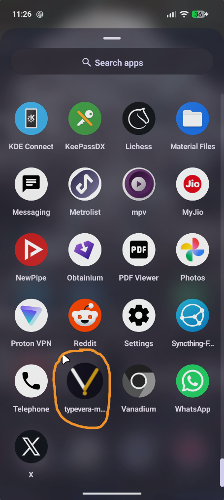
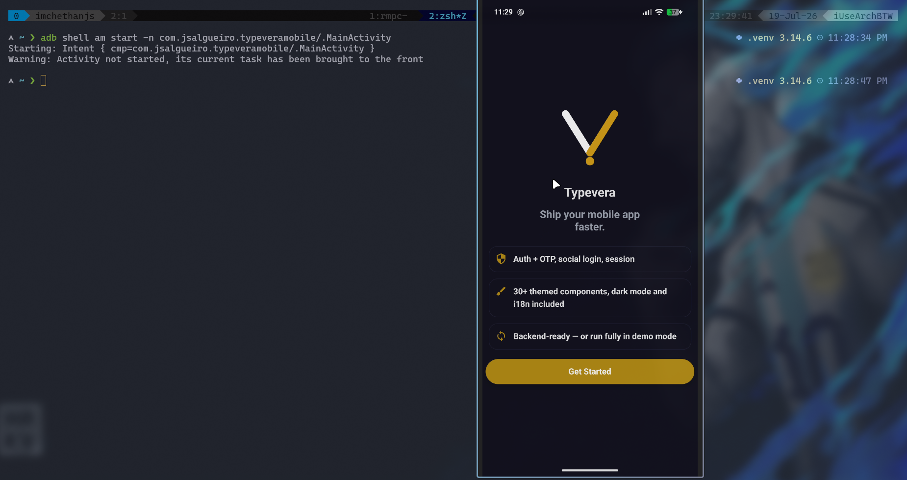
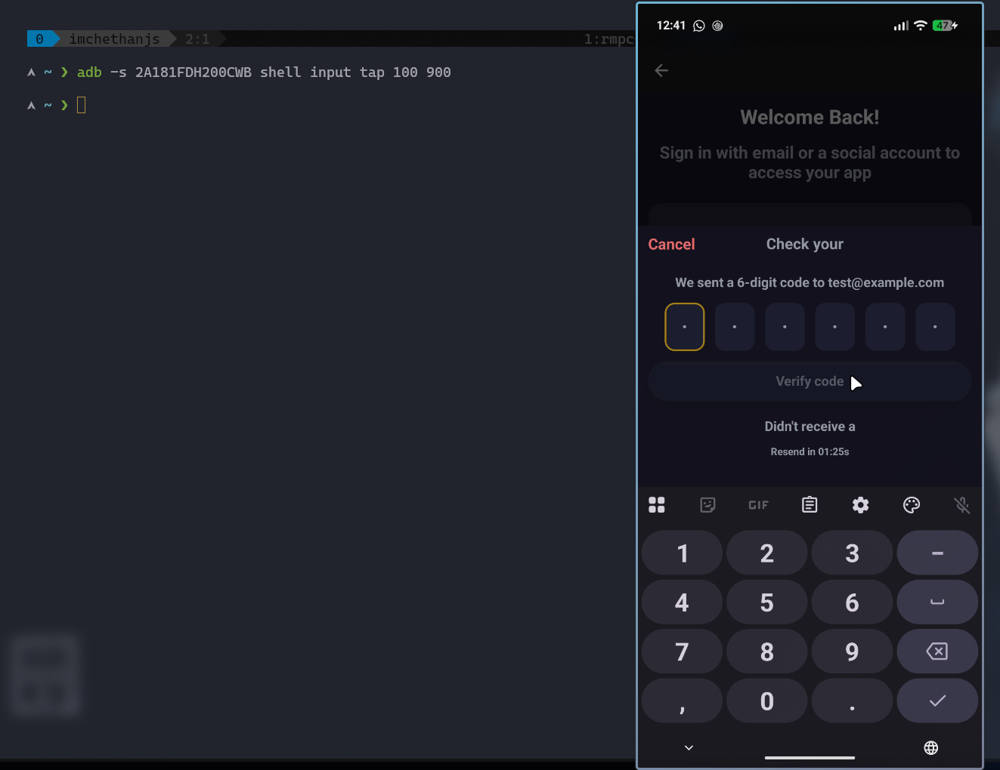
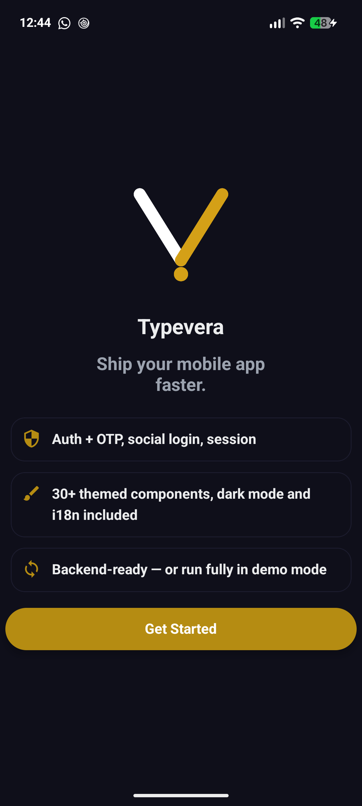

## Assignment 4 – Mobile Automation

---

### Using Android Emulator or a real device, Automate the following:

```bash
󰣇 ~ ❯ adb devices                                                                                                                       .venv 3.14.6  11:20:40 PM
List of devices attached
2A181FDH200CWB	device
```

####  Install application:

- Installation:

```bash
󰣇 ~ ❯ adb install Downloads/typevera-mobile-v1.0.0.apk                                                                                  .venv 3.14.6  11:22:00 PM
Performing Streamed Install
Success
```

- Verification:

```bash
󰣇 ~ ❯ adb shell pm list packages | grep typevera                                                                                        .venv 3.14.6  11:24:53 PM
package:com.jsalgueiro.typeveramobile
```



---

####  Launch application

```bash
󰣇 ~ ❯ adb shell am start -n com.jsalgueiro.typeveramobile/.MainActivity                                                                 .venv 3.14.6  11:28:34 PM
```



---

####  Perform login

```bash
󰣇 ~ ❯ adb -s 2A181FDH200CWB exec-out uiautomator dump --compressed /dev/tty                                                             .venv 3.14.6  11:38:36 PM
<?xml version='1.0' encoding='UTF-8' standalone='yes' ?><hierarchy rotation="0"><node index="0" text="" resource-id="" class="android.widget.FrameLayout" package="com.jsalgueiro.typeveramobile" content-desc="" checkable="false" checked="false" clickable="false" enabled="true" focusable="false" focused="false" scrollable="false" long-clickable="false" password="false" selected="false" bounds="[0,0][1080,2400]" drawing-order="0" hint=""><node index="0" text="" resource-id="" class="android.widget.ScrollView" package="com.jsalgueiro.typeveramobile" content-desc="" checkable="false" checked="false" clickable="false" enabled="true" focusable="false" focused="false" scrollable="false" long-clickable="false" password="false" selected="false" bounds="[0,0][1080,2400]" drawing-order="1" hint=""><node index="0" text="" resource-id="" class="android.widget.ScrollView" package="com.jsalgueiro.typeveramobile" content-desc="" checkable="false" checked="false" clickable="false" enabled="true" focusable="false" focused="false" scrollable="false" long-clickable="false" password="false" selected="false" bounds="[0,0][1080,2400]" drawing-order="1" hint=""><node index="0" text="" resource-id="" class="android.widget.ImageButton" package="com.jsalgueiro.typeveramobile" content-desc="Navigate up" checkable="false" checked="false" clickable="true" enabled="true" focusable="true" focused="false" scrollable="false" long-clickable="false" password="false" selected="false" bounds="[0,136][147,283]" drawing-order="2" hint="" /><node index="1" text="" resource-id="" class="android.view.ViewGroup" package="com.jsalgueiro.typeveramobile" content-desc="Welcome Back!, Sign in with email or a social account to access your app, , Please enter a valid email, Or, , Your data is secure. We never share your information." checkable="false" checked="false" clickable="true" enabled="true" focusable="false" focused="false" scrollable="false" long-clickable="false" password="false" selected="false" bounds="[0,283][1080,2400]" drawing-order="1" hint=""><node index="0" text="Welcome Back!" resource-id="" class="android.widget.TextView" package="com.jsalgueiro.typeveramobile" content-desc="" checkable="false" checked="false" clickable="false" enabled="true" focusable="false" focused="false" scrollable="false" long-clickable="false" password="false" selected="false" bounds="[321,314][759,398]" drawing-order="1" hint="" /><node index="1" text="Sign in with email or a social account to access your app" resource-id="" class="android.widget.TextView" package="com.jsalgueiro.typeveramobile" content-desc="" checkable="false" checked="false" clickable="false" enabled="true" focusable="false" focused="false" scrollable="false" long-clickable="false" password="false" selected="false" bounds="[32,430][1048,563]" drawing-order="2" hint="" /><node index="2" text="" resource-id="" class="android.widget.TextView" package="com.jsalgueiro.typeveramobile" content-desc="" checkable="false" checked="false" clickable="false" enabled="true" focusable="false" focused="false" scrollable="false" long-clickable="false" password="false" selected="false" bounds="[97,688][150,743]" drawing-order="3" hint="" /><node index="3" text="Email Address" resource-id="" class="android.widget.EditText" package="com.jsalgueiro.typeveramobile" content-desc="" checkable="false" checked="false" clickable="true" enabled="true" focusable="true" focused="true" scrollable="false" long-clickable="true" password="false" selected="false" bounds="[182,660][984,772]" drawing-order="4" hint="Email Address" /><node index="4" text="Please enter a valid email" resource-id="" class="android.widget.TextView" package="com.jsalgueiro.typeveramobile" content-desc="" checkable="false" checked="false" clickable="false" enabled="true" focusable="false" focused="false" scrollable="false" long-clickable="false" password="false" selected="false" bounds="[31,837][1048,869]" drawing-order="5" hint="" /><node index="5" text="" resource-id="" class="android.view.ViewGroup" package="com.jsalgueiro.typeveramobile" content-desc="Continue with Email" checkable="false" checked="false" clickable="true" enabled="false" focusable="true" focused="false" scrollable="false" long-clickable="false" password="false" selected="false" bounds="[16,917][1064,1043]" drawing-order="10" hint=""><node index="0" text="Continue with Email" resource-id="" class="android.widget.TextView" package="com.jsalgueiro.typeveramobile" content-desc="" checkable="false" checked="false" clickable="false" enabled="true" focusable="false" focused="false" scrollable="false" long-clickable="false" password="false" selected="false" bounds="[352,948][727,1011]" drawing-order="1" hint="" /></node><node index="6" text="Or" resource-id="" class="android.widget.TextView" package="com.jsalgueiro.typeveramobile" content-desc="" checkable="false" checked="false" clickable="false" enabled="true" focusable="false" focused="false" scrollable="false" long-clickable="false" password="false" selected="false" bounds="[518,1090][561,1153]" drawing-order="6" hint="" /><node index="7" text="" resource-id="" class="android.view.ViewGroup" package="com.jsalgueiro.typeveramobile" content-desc=", Continue with Google" checkable="false" checked="false" clickable="true" enabled="true" focusable="true" focused="false" scrollable="false" long-clickable="false" password="false" selected="false" bounds="[32,1217][1049,1343]" drawing-order="7" hint=""><node index="0" text="" resource-id="" class="android.widget.TextView" package="com.jsalgueiro.typeveramobile" content-desc="" checkable="false" checked="false" clickable="false" enabled="true" focusable="false" focused="false" scrollable="false" long-clickable="false" password="false" selected="false" bounds="[296,1248][350,1311]" drawing-order="1" hint="" /><node index="1" text="Continue with Google" resource-id="" class="android.widget.TextView" package="com.jsalgueiro.typeveramobile" content-desc="" checkable="false" checked="false" clickable="false" enabled="true" focusable="false" focused="false" scrollable="false" long-clickable="false" password="false" selected="false" bounds="[382,1251][784,1308]" drawing-order="2" hint="" /></node><node index="8" text="" resource-id="" class="android.widget.TextView" package="com.jsalgueiro.typeveramobile" content-desc="" checkable="false" checked="false" clickable="false" enabled="true" focusable="false" focused="false" scrollable="false" long-clickable="false" password="false" selected="false" bounds="[123,1421][186,1547]" drawing-order="8" hint="" /><node index="9" text="Your data is secure. We never share your information." resource-id="" class="android.widget.TextView" package="com.jsalgueiro.typeveramobile" content-desc="" checkable="false" checked="false" clickable="false" enabled="true" focusable="false" focused="false" scrollable="false" long-clickable="false" password="false" selected="false" bounds="[218,1421][958,1547]" drawing-order="9" hint="" /></node></node></node></node></hierarchy>UI hierchary dumped to: /dev/tty

󰣇 ~ ❯ adb -s 2A181FDH200CWB shell input tap 200 700                                                                                                    12:35:49 PM

󰣇 ~ ❯ adb -s 2A181FDH200CWB shell input text "test@example.com"                                                                                        12:37:40 PM

󰣇 ~ ❯ adb -s 2A181FDH200CWB shell input tap 100 900                                                                                                    12:40:18 PM
```



---

####  Capture screenshot

```bash
󰣇 ~ ❯ adb -s 2A181FDH200CWB exec-out screencap -p > screenshot.png                                                                                     12:45:01 PM
```



---

####  Collect Logcat logs

```bash
󰣇 ~ ❯ adb -s 2A181FDH200CWB logcat -c                                                                                                                  12:54:11 PM

󰣇 ~ ❯ adb -s 2A181FDH200CWB shell input tap 200 700                                                                                                    12:54:17 PM

󰣇 ~ ❯ adb -s 2A181FDH200CWB shell input text "test@example.com"                                                                                        12:54:35 PM

󰣇 ~ ❯ adb -s 2A181FDH200CWB shell input tap 100 900                                                                                                    12:54:45 PM

󰣇 ~ ❯ adb -s 2A181FDH200CWB logcat -v time > logcat.txt                                                                                                12:54:54 PM
^C
```

Output file: logcat.txt

---

####  Uninstall application

```bash
󰣇 ~ ❯ adb -s 2A181FDH200CWB uninstall com.jsalgueiro.typeveramobile                                                                                    12:56:36 PM
Success
```

---
