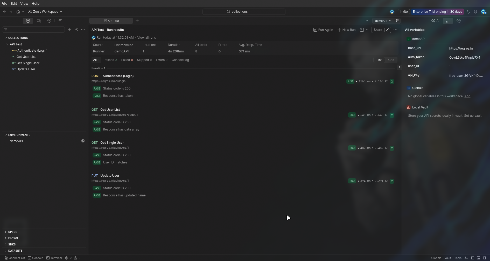

## Assignment 1 – API Testing (Postman)

### Objective:

Create a Postman collection that:

1. Authenticates a user.
2. Stores the authentication token.
3. Calls three dependent APIs.
4. Validates responses.
5. Generates a collection report.

Use environment variables wherever applicable.

---

### Step 1: Create a Postman Environment

1. In Postman, click **Environments** → **Create Environment**.

| Variable     | Value               |
| ------------ | ------------------- |
| `base_url`   | `https://reqres.in` |
| `auth_token` |                     |
| `user_id`    |                     |

---

### Step 2: Create the Collection

1. Click **Collections** → **New Collection**.
2. Name it `API Test`.
3. Under **Variables**, add `base_url` with value `https://reqres.in`.

---

### Step 3: Add Requests

#### Request 1: Authenticate (Login)

- **Method**: `POST`
- **URL**: `{{base_url}}/api/login`
- **Body** (raw JSON):

```json
{
  "email": "eve.holt@reqres.in",
  "password": "cityslicka"
}
```

**Tests** :

```javascript
pm.test("Status code is 200", function () {
  pm.response.to.have.status(200);
});

pm.test("Response has token", function () {
  const response = pm.response.json();
  pm.expect(response.token).to.exist;
  pm.environment.set("auth_token", response.token);
});
```

---

#### Request 2: Get User List

- **Method**: `GET`
- **URL**: `{{base_url}}/api/users?page=1`

**Tests**:

```javascript
pm.test("Status code is 200", function () {
  pm.response.to.have.status(200);
});

pm.test("Response has data array", function () {
  const response = pm.response.json();
  pm.expect(response.data).to.be.an("array");
  if (response.data.length > 0) {
    pm.environment.set("user_id", response.data[0].id);
  }
});
```

---

#### Request 3: Get Single User

- **Method**: `GET`
- **URL**: `{{base_url}}/api/users/{{user_id}}`

**Tests**:

```javascript
pm.test("Status code is 200", function () {
  pm.response.to.have.status(200);
});

pm.test("User ID matches", function () {
  const response = pm.response.json();
  pm.expect(response.data.id).to.eq(parseInt(pm.environment.get("user_id")));
});
```

---

#### Request 4: Update User

- **Method**: `PUT`
- **URL**: `{{base_url}}/api/users/{{user_id}}`
- **Body** (raw JSON):

```json
{
  "name": "QA Engineer",
  "job": "Automation Tester"
}
```

**Tests**:

```javascript
pm.test("Status code is 200", function () {
  pm.response.to.have.status(200);
});

pm.test("Response has updated name", function () {
  const response = pm.response.json();
  pm.expect(response.name).to.eq("QA Engineer");
  pm.expect(response.job).to.eq("Automation Tester");
});
```

---

### Step 4: Run the Collection and Generate Report

1. Click the **Runner** button.
2. Select your collection and environment.
3. Click **Run API Test**.

---

### Step 5: Environment Variables Summary

| Variable     | Purpose                                                              |
| ------------ | -------------------------------------------------------------------- |
| `base_url`   | Base URL for all requests.                                           |
| `auth_token` | Stores the token from login (can be used in headers for other APIs). |
| `user_id`    | Stores the first user ID from the list for dependent calls.          |

---

### Output:


