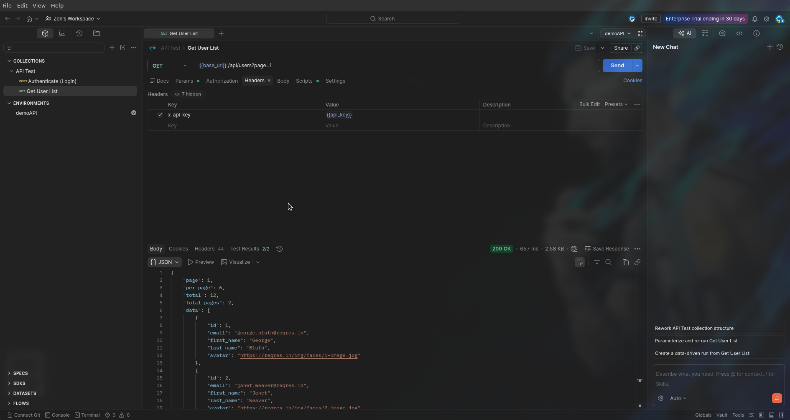

## Assignment 6 - API Request Design

---

### Scenario

### A REST API is available to retrieve all connected Access Points.

- GET /api/accesspoints

### Task:

### Using Postman, explain how you would test this API.

- Your answer should include:
  - HTTP Method
  - Request URL
  - Expected Status Code
  - Expected Response Format
  - Three validations

Also, submit a screenshot of any one postman query using any of the APIs.

---

#### HTTP Method:

GET

---

#### Request URL:

https://<ip/domain_name>/api/accesspoints

---

#### Expected Status Code:

200 OK

---

#### Expected Response Format:

```json
{
  "status": "success",
  "data": [
    {
      "ap_id": "AP-001",
      "name": "Floor1-AP1",
      "mac": "aa:bb:cc:dd:ee:ff",
      "ip": "192.168.1.10",
      "status": "online",
      "clients": 12
    },
    {
      "ap_id": "AP-002",
      "name": "Floor1-AP2",
      "mac": "11:22:33:44:55:66",
      "ip": "192.168.1.11",
      "status": "offline",
      "clients": 0
    }
  ],
  "total": 2
}
```

---

#### 5. Three Validations

| #   | Validation             | Description                                                                                        |
| --- | ---------------------- | -------------------------------------------------------------------------------------------------- |
| 1   | **Status Code**        | Verify the API returns `200 OK` for a successful request.                                          |
| 2   | **Response Structure** | Check that the response contains `status`, `data`, and `total` fields.                             |
| 3   | **Data Type**          | Ensure `data` is an array and each item has `ap_id`, `name`, `mac`, `ip`, `status`, and `clients`. |

---

#### Screenshot:


